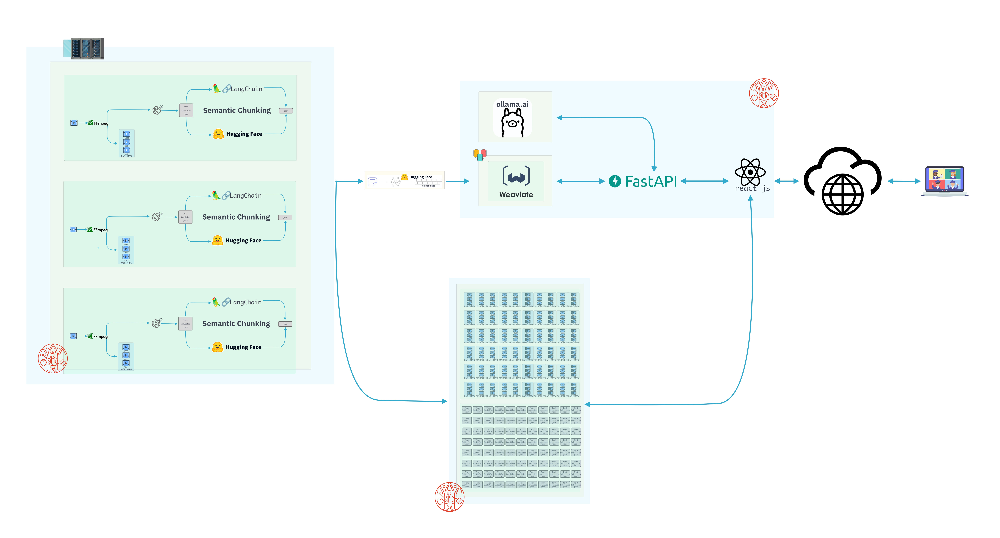
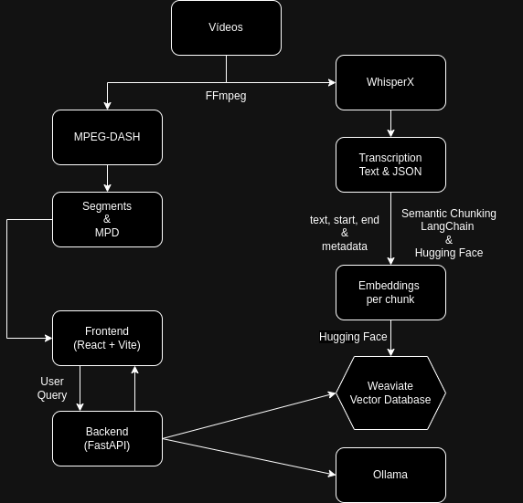

# deep-learning-multimodal

## Visuals

### Detailed Visual Representation

*This detailed diagram provides a visual representation of various components and interactions.*

### Conceptual Diagram

*This conceptual diagram illustrates key concepts and relationships.*
